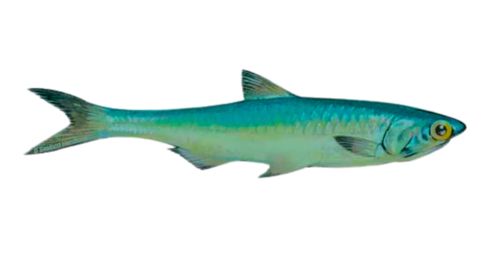

<p align="center">
  
</p>

[](https://github.com/hafiz122/budu/actions/workflows/ci.yml)

Budu is an open-source macOS launcher for Windows Steam games. It manages
isolated Wine bottles, downloads Windows depots with SteamCMD, and configures an
open Direct3D-to-Metal stack for Apple Silicon.

Budu does **not** require CrossOver.

## Runtime

The default runtime is:

- Wine Staging 11.10
- DXMT 0.74 for Direct3D 10/11
- Rosetta 2 for x86-64 execution on Apple Silicon
- A small GPL-3.0-only SteamWebHelper shim for Steam's black-window issue

Wine and DXMT are downloaded from their public releases on first install and
verified with pinned SHA-256 checksums. Budu then applies its bundled,
source-reproducible Wine/DXMT window bridge. CrossOver and Apple's proprietary
D3DMetal are not bundled.

The Steam shim does not bypass authentication, ownership checks, or DRM. It
preserves Valve's original executable and only starts it with software
compositing, working around Wine/macOS's missing cross-process presentation
path. Steam may replace the shim during an update; Budu reapplies it on
the next launch.

## Requirements

- Apple Silicon Mac
- macOS 14 or newer
- Rosetta 2
- A Steam account that owns the games you launch

For development:

- Rust 1.77+
- Node.js 20+
- Xcode Command Line Tools
- `mingw-w64` when rebuilding the Steam shim

## Build and run

```bash
git clone https://github.com/hafiz122/budu.git
cd budu
make bootstrap
make dev
```

Create a release app with:

```bash
make build
```

The macOS bundle is written to
`src-tauri/target/release/bundle/macos/Budu.app`.

## Releases and security

Pre-release builds are experimental and currently unsigned. Download them only
from Budu's official GitHub Releases page, and back up game saves before
testing. Budu is not affiliated with Valve or Steam.

Before publishing a stable release, I will sign the app with a Developer ID
certificate, notarize it with Apple, and staple the notarization ticket to the
distributed app and DMG.

Security reports should use GitHub's private vulnerability reporting feature.

## Using Budu

1. Open **Settings** and select **Install Wine**.
2. Install or import a Windows Steam game.
3. Select the game or its `.exe`.
4. Choose the managed bottle assigned to that game and launch it.

Budu keeps SteamCMD storage shared, but each game has its own managed
bottle configuration.

Upgrades preserve the existing `~/.gamerunner` data directory and
`gamerunner-*` preference keys so bottles created before the rename continue to
work.

## Project layout

```text
src-tauri/   Rust/Tauri backend
ui/          React/TypeScript frontend
runtime/     Open-source runtime helpers and reproducible shim source
compat-db/   Bundled game compatibility entries
wine/        Wine source-build tooling
scripts/     Developer and release scripts
docs/        Architecture and contributor documentation
```

## Contributing

See [docs/contributing.md](docs/contributing.md) and
[docs/building.md](docs/building.md). Compatibility fixes should be narrowly
scoped, tested against a named Wine/Steam version, and documented so the next
maintainer can reproduce them.

## License

Budu is licensed under the
[GNU General Public License v3.0 only](LICENSE). Downloaded runtime components
retain their own licenses; see [THIRD_PARTY_NOTICES.md](THIRD_PARTY_NOTICES.md).
